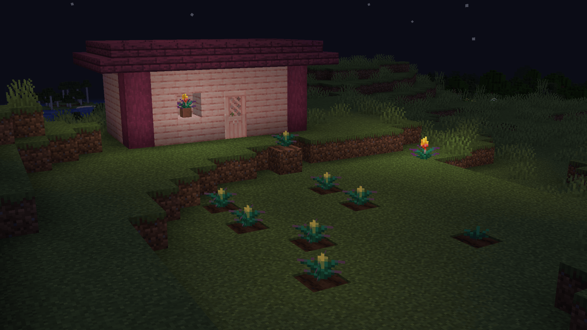

## Glowing Torchflower

Works better when installed on both the server and the client

[CurseForge](https://www.curseforge.com/minecraft/mc-mods/glowing-torchflower), [Modrinth](https://modrinth.com/mod/glowing-torchflower)

[Discord](https://discord.gg/UY4nhvUzaK)

### Ligth level
- Torchflower: 12
- Torchflower in pot: 14
- Torchflower crop, small: 3
- Torchflower crop, medium: 7
- Torchflower crop, big: 12

